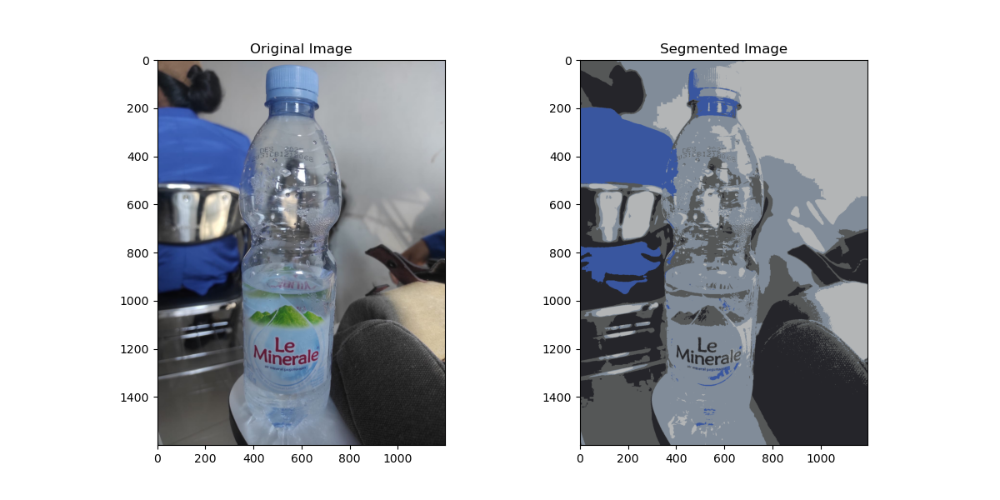

|       | Anggota |
| ----------- | ----------- |
| | Muhammad Din Al Ayubi (312210293)|
| | Mohammad Hegar Sukmana Wibowo (312210332)|
| | Muhammad Albedri (312210290)|
| Kelas   | TI.22.A.3        |
| Tugas   | UAS PENGELOLAAN CITRA        |

Pengambilan Potret Di Dalam Ruangan Menggunakan Handphone Merk Vivo Y100 5G Dengan Kamera Belakang 50 Megapixel 

Pengambilan Potret Di Dalam Ruangan Menggunakan Handphone Merk Vivo Y100 5G Dengan Kamera Depan 8 Megapixel

Pengambilan Potret Di Dalam Ruangan Menggunakan Handphone Merk Xiaomi Redmi Not 9 Pro Dengan Kamera Belakang 64 Megapixel

Pengambilan Potret Di Dalam Ruangan Menggunakan Handphone Merk Vivo Y100 5G Dengan Kamera Belakang 50 Megapixel